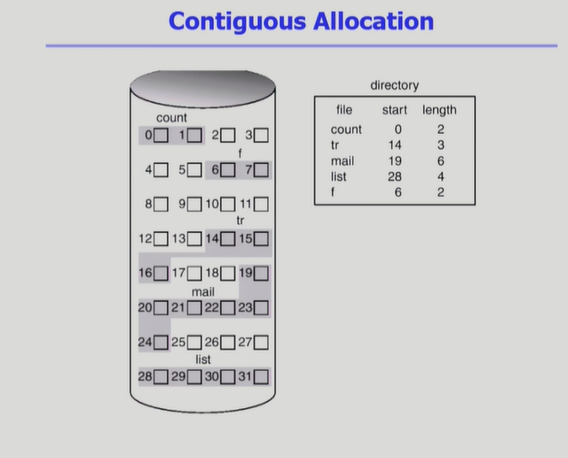
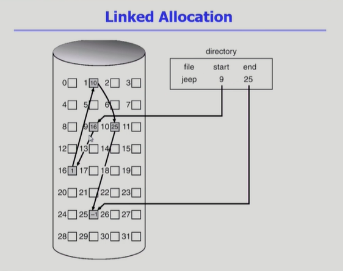
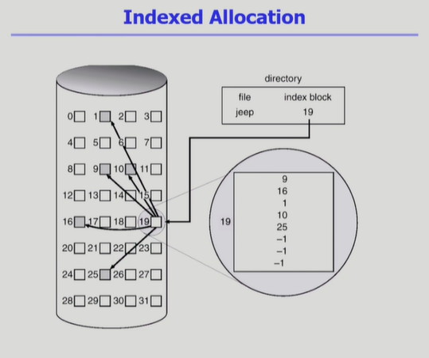
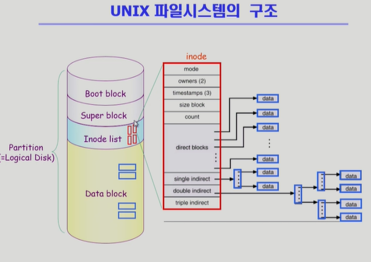
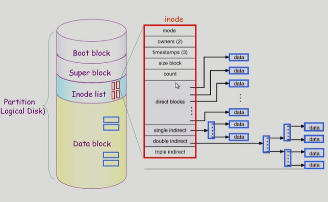
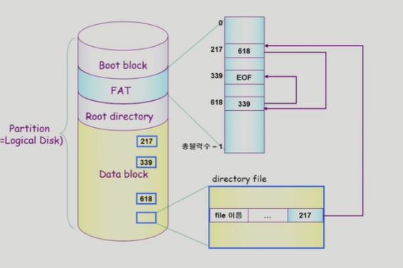

## File System Implementation

### Allocation of file Data in Disk *디스크에 파일 저장하기*

: 파일은 크기가 일정하지 않지만 디스크에 저장할 때는 동일한 크기의 sector 단위로 나누어 저장.

- Contiguous Allocation 연속 할당
    - 하나의 파일이 디스크 상에서 연속해서 저장(인접한 블럭 번호 가지도록 저장)
        
    - directory : directory 밑에 있는 파일들의 meta data(파일 이름, 위치 정보 등)를 내용으로 갖게 됨.
    - **장점**
        - 빠른 I/O
            
            ⇒ 하드디스크의 대부분의 접근 시간은 disk head가 바깥에서 안쪽으로 접근하는 데에 쓰임. 실제 데이터 읽는 것엔 데이터 크기 상관없이 크게 시간 쓰지 않음.
            
            : 이 방식은 한번 시작점 도착하면 한번에 다 읽어올 수 있음.(한 번의 seek)
            
            ⇒ swap area(process 끝나면  사라짐. 따라서 공간효율성보다 시간효율성이 중요) : **swapping 용으로 사용**
            
            ⇒ realtime용
            
        - 직접 접근 가능
    - **단점**
        - 각각의 파일의 크기가 균일하지 않기 때문에 free block(내용 없는 블럭)이 생기게 됨 ⇒ 비어있음에도 활용 불가능한 공간 생김 : **외부 조각*External Fragmentation***
            
            ex - block 3개 크기의 파일이 있으면 17, 18 비었음에도 거기에 할당 불가
            
        - 파일의 수정 시 최대 범위에 한계가 생기게 됨(비어있는 block까지만)
            
            ⇒ 미리 커질 것 생각해서 빈 공간 마련해 놓는 것은?
            
            : 그래도 그만큼까지만 커질 수밖에 없는데다가 파일 크기 커지기 전까진 해당 블럭 사용 못하고 비어있게 됨.
            
- Linked Allocation 연결 할당
    - 연속하지 않고 빈 위치 아무데나 파일 할당. (앞서 연속할당에서 본 외부 조각 막기 위해.)
        
        
        
    - 파일의 시작 위치만 directory가 갖고 있고 그 다음 위치들은 시작 위치에 가보면 다음 위치 어디인지 알 수 있음
    - **장점**
        - External fragmentation(외부 조각) 발생 안 함
    - **단점**
        - 직접접근 불가. (no random access)
            - 네번째 블럭 접근하고 싶다면?
                - 연속 할당 : 시작점+3
                - 연결 할당: 첫 위치 → 거기에 연결된 두번째 위치→ 거기에 연결된 세번째 위치 → 거기에 연결된 네번째 위치 찾아가야함.
                    
                    ; 건너 뛰기 불가. 순차접근만 가능(여러번의 seek)
                    
        - Reliability 문제
            - 한 sector가 고장나 pointer 유실되면 그 다음 위치들 다 접근할 수 없음
        - Pointer를 위한 공간이 block의 일부가 되어 공간 효율성을 떨어트림.
            - sector : 보통 512 byte , pointer :4 byte
            - 보통 이 크기에 맞게 512바이트씩 저장 요청이 오는데 pointer에 4바이트 쓰는 순간 508바이트 밖에 못 쓰게 되고, 이 나머지 4 바이트 저장을 위해 추가 sector 하나를 더 쓰게 되는 문제 발생
    - **변형**
        - **File-allocation table(FAT)** 파일 시스템
            - 포인터를 별도 위치에 저장해 reliability와 공간 효율성 문제 해결
- Indexed Allocation
    - directory에 파일 위치 정보 바로 저장하는 게 아니라 인덱스 저장
        
        인덱스 블럭은 해당 파일이 어느 블럭들에 저장되어 있는지를 저장함
        
        
        
    - **장점**
        - 직접 접근 가능
        - External fragmentation (외부조각- hole 발생 문제) 발생하지 않음
    - **단점**
        - small file의 경우 공간 낭비
            - 아무리 작은 파일도 해당 파일용 블럭, 인덱스 블럭 이렇게 최소 2개의 블럭 필요
            - 그런데 많은 파일들이 작음
        - 너무 큰 파일의 경우 하나의 인덱스 블럭으로 모든 블럭 위치를 다 담을 수 없음.
        - 이를 해결하기 위해
            
            ⇒ linked scheme 📌 👇 : 인덱스 블럭에  마지막에는 파일 내용이 아니라 다음 인덱스 블럭 위치 적기. 인덱스 블럭 여러개 만들기. (파일 내용들 적다가 마지막만 다음 인덱스)
            
            ⇒ multi-level index :  인덱스 블럭안에 다른 인덱스들 담기.(다른 인덱스들 좌자자작 담아서 2번 거쳐서 파일에 접근)
            

### UNIX의 파일 시스템 구조

1. Boot block
    
    : unix 뿐만 아니라 어떤 파일 시스템이든 가장 먼저 나오는 블럭
    
    - 부팅에 필요한 정보(bootstrap loader)
2. Super block
    - 파일 시스템에 관한 총체적인 정보를  담고 잇음
3. Inode list
    - directory가 파일의 모든 meta data를 갖는 게 아니라 일부만 갖고 있고, meta data는 따로 빼서 저장 ⇒ 이 meta data 저장 위치가 바로 inode list
        
        
        
    - Inode : index node
    - 다만 unix에서 파일의 meta data 중 file 이름은 inode가 아닌 directory가 갖고 있음. 파일 이름 제외 나머지 모든 메타 데이터는 inode에 저장
    - 파일 시스템은 어떻게 ? ⇒ Index Allocation 사용
        
        크기 매우 작은 파일
        
        1. direct index : direct index 포인터 로 직접 가리키기
        
        크기 매우 큰 파일
        
        1. single indirect : single indirect가 가리키는 곳 가면 index 블럭이 있음. 그 인덱스 블럭의 포인터 따라가면 실제 파일 위치.
        2. double indirect : single보다 인덱스 블럭 한 번 더 거치기
        3. triple indirect : double보다 인덱스 블럭 한 번 더 거치기
4. Data block
    - 파일의 실제 내용 저장

### FAT File System

: MS dos 만들 때 만들어진 시스템. 아직도 window에서는 쓰임

1. Boot blcok
2. FAT
    
    : 메타 데이터 중 일부(위치 정보만) FAT에 저장
    
3. Root directory ( linked allocation 활용한 변형 시스템)
    - directory가 위치 정보 제외 나머지 메타 데이터 전부 갖고 있음.
    - 파일의 시작 위치까지!도 directory가 갖고 있고, FAT에 다음 위치를 저장함.
    - FAT은 해당 파일의 sector 개수만큼 블럭을 갖고 있고, 각각의 블럭에는 해당 블럭의 다음 블럭 위치가 적혀 있음.
        
        ⇒ 직접 접근 가능. FAT이라는 작은 테이블은 이미 메모리에 올라가 있기에 해당 테이블에서 네번째 블럭 위치 찾아가서 실제 데이터에선 네 번째 블럭으로 바로 접근 가능.
        
    - FAT은 매우 중요한 정보기에 보통 2 copy 이상 저장
4. Data block

---

### Free-Space Management

: 비어있는 메모리 블럭 어떻게 관리하는가?

1. Bit map (= bit vector)
    - 각 블럭이 사용중인지 비어있는지 0과 1로 나타내는 비트 맵 만들어 블럭 관리
    - Bit map을 위한 부가적 공간을 필요로 함
    - 연속적인 n개의 빈 블럭을 찾는데 효과적.
2. Linked list 
    - 비어있는 블럭들을 포인터로 연결하기. 다음 빈 블럭이 어디인지.
    - bit map과 달리 추가적 공간 낭비 없음
    - 그러나 연속적인 빈 블럭 찾기 힘들어서 실제론 잘 안씀.
3. Grouping (linked list 방법 차용 👆 )
    - 첫 번째 빈 블럭이 n개의 포인터로 비어있는 블럭들 가리키기(인덱스 블럭처럼). 마지막 포인터는 그 다음 인덱스 블럭 역할 블럭 가리키기.
4. Counting
    - 프로그램들이 종종 여러 개의 연속적인 block을 할당하고 반납한다는 성질에서 착안
    - 빈 블럭의 첫 번째 위치와, 거기서부터 연속으로 몇 개의 블럭이 비어있는지를 함께 묶어서 관리
    

### Directory implementation

: 디렉토리 구현 어떻게 하는가?

1. **Linear list**
    - <file name, file metadata> list로 만들기
    - 각 항목 별 용량 정해놓기(이름 몇 바이트, 메타 데이터 몇 바이트)
        - n번째 파일 이름 찾으려면? 각 항목 몇 바이트 쓰는지 아니까 (n-1)*(소모 바이트)
    - 구현이 간단
    - 디렉토리 내 파일이 있는지 찾으려면 linear search 필요(time-consuming)
2. **Hash Table**
    - linear list + hashing
        - hash함수 적용하면 항상 특정 범위 내로 결과값 제한됨(예를 들면 hash함수로 10으로 나눈 나머지 쓰겠다? ⇒0~9로 제한되는 것처럼)
    - Hash table은 file name을 이 파일의 linear list의 위치로 바꾸어줌
    - search time을 없앰
        - 그냥 해시 함수 적용하고 결과값 바로 찾으면 됨.
    - Collision 발생 가능
        - 서로 다른 파일 이름에 대해 같은 결과값 mapping 되는 문제
- File의 metadata 보관 위치
    - 디렉토리 내 직접 보관
    - 디렉터에 포인터 두고 다른 곳에 보관
        - inode, FAT 등
- Long file name의 지원
    - file name, file metadata의 list에서는 각 entry는 일반적으로 고정된 크기
    - file name이 고정 크기의 entry보다 길어지는 경우 entry의 마지막 부분에 이름의 뒷부분이 위치한 곳의 포인터를 두는 방법
    - 이름의 나머지 부분은 동일한 directory file의 일부에 존재

### VFS and NFS

**Virtual File System(VFS)**

- 서로 다른 다양한 file system에 대해 동일한 시스템 콜 인터페이스(API)를 통해 접근할 수 있게 해주는 OS의 layer

**Network File System(NFS)**

- 분산 시스템에서는 네트워크를 통해 파일이 공유될 수 있음
- NFS는 분산 환경에서의 대표적인 파일 공유 방법

### Page Cache and Buffer Cache

- **Page Cache**
    - virtual memory의 시스템에서 사용하는 page frame을 caching의 관점에서 설명하는 용어
    - memory-mapped i/o 를 쓰는 경우 file의 i/o에서도 page cache 사용
- **Memory-Mapped I/O**
    - 파일의 일부를 virtual memory에 mapping 시킴
    - 매핑시킨 영역에 대한 메모리 접근 연산은 파일의 입출력을 수행하게 함
- **Buffer Cache**
    - 파일 시스템을 통한 I/O 연산은 메모리의 특정 영역인 buffer cache에서 사용
    - 파일의 locality 활용
    - 모든 프로세스가 공용으로 사용
    - Replacement algorithm 필요
- **Unified Buffer Cache**
    
    : buffer cache가 page cache에 통합됨. 최근 추세
    
    - 버퍼 캐시도 page단위로 관리
    

---

## Disk Management & Scheduling

### Disk Structure

- logical block
    
    : 디스크 **외부**에서 보는 디스크의 **단위 정보 저장 공간들**
    
    - 주소를 가진 1차원 배열처럼 취급
    - 정보 전송하는 최소 단위
- Sector
    - logical block이 물리적인 디스크에 매핑된 위치
    - Sector 0은 최외곽 실린더의 첫 트랙에 있는 첫 번째 섹터

### Disk Formatting

- **Physical formatting(=Low level formatting)**
    - 디스크를 컨트롤러가 읽고 쓸 수 있도록 섹터들로 나누는 과정
    - 각 섹터는 header + 실제 data(보통 512 bytes) + trailer로 구성
    - header와 tailer는 sector number, ECC(Error-Correcting Code, 데이터 축약본으로 에러 검출 역할)등의 정보가 저장되며 controller가 직접 접근 및 운영(헤드&트레일러 : 데이터의 부가정보를 저장하는 곳)
- Partitioning
    - 디스크를 하나 이상의 실린더 그룹으로 나누는 과정
    - OS는 이것을 독립적 disk로 취급(logical disk)
- Logical formatting
    - 파일 시스템을 만드는 것
    - **FAT, inode**, free space 등의 구조를 포함
- Booting
    - ROM에 있는 small bootstrap loader의 실행
    - sector 0(boot block)을 load하여 실행
    - sector 0은 full Bootstrap loader program
    - OS를 디스크에서 load하여 실행

### Disk Scheduling

- **Access Time**의 구성
    1. **Seek time** : 헤드를 해당 실린더로 움직이는데 걸리는 시간 (가장 오래 걸림)
    2. **Rotational latency** : 헤드가 원하는 섹터에 도달하기까지 걸리는 회전지연시간
    3. **Transfer time** : 실제 데이터의 전송 시간 (별로 안 걸림)
- **Disk bandwidth**
    - 단위 시간 당 전송된 바이트의 수
- Disk Scheduling
    - seek time 최소화가 목표(= access time을 가장 많이 잡아 먹는 것)
    

### Disk Scheduling Algorithm

1. **FCFS(first come first served)**
    
    : 입력된 순서대로 처리
    
    - head 이동 많아지기 때문에 비효율적
2. **SSTF(shortest seek time first)**
    
    : 현재 헤드에서 가장 가까운 요청 순서대로 처리
    
    - starvation 문제 : 무한히 대기하는 요청 생길 수도
3. **SCAN(= elevator scheduling)**
    
    : disk arm이 디스크의 **한쪽 끝에서 다른쪽 끝으로 이동하며 가는 길목에 있는 모든 요청을 처리** 
    
    ⇒ 다른 한쪽 끝에 도달하면 **역방향 이동하며 이동 길목에 있는 모든 요청 처리**
    
    - 문제점: 실린더 위치에 따라 대기 시간이 달라짐
        
        ⇒ 가장 끝 지점은 헤드를 놓친지 얼마 안 되었어도 한 바퀴 다 돌아야만 차례가 다시 옴.
        
4. **C-SCAN(Circular SCAN)**
    
    : 헤드가 **한쪽 끝에서 다른쪽 끝으로 이동하며 가는 길목에 있는 모든 요청을 처리**
    
    ⇒ 다른쪽 끝에 도달하면 요청 처리하지 않고 곧바로 **출발점으로 회귀**
    
    - SCAN보다 대기시간 균일, 보다 공정
5. **N-SCAN**
    - SCAN 변형 알고리즘
    - head가 지나가면서 요청 처리, **지나는 도중에 들어온 요청**은 그 턴에서 처리하지 않고 다시 이동하며 처리
6. **LOOK**
    - SCAN과 C-SCAN의 단점을 수정. SCAN의 경우 가는 길목에 더 이상 요청이 없어도 무조건 끝지점까지 이동.
    
    ⇒ LOOK : 더 이상 요청이 없으면 방향 바꾸기
    
7. **C-LOOK**
    
    : C-SCAN을 LOOK처럼 처리. 더 이상 요청 없으면 원점 회귀.
    
- Disk-Scheduling Alogrithm의 결정
    - SCAN에 기반한 알고리즘(SCAN, C-SCAN, LOOK, C-LOOK) 등이 일반적으로 디스크 입출력이 많은 시스템에서 효율적이기에 주로 사용
    - File 할당 방법에 따라 디스크 요청이 영향을 받음
    - 디스크 스케줄링 알고리즘은 필요할 경우 다른 알고리즘으로 쉽게 교체할 수 있도록 OS와 별도의 모듈로 작성하는 것이 바람직
        
        → 상황에 따라 최적화 알고리즘 사용
        

### Swap-Space Management

- Disk 사용하는 이유
    1. memory의 휘발성 → file system처럼 영속적이어야 하는 것들은 D-ram 사용
    2. 프로그램 실행을 위한 memory 공간 부족 → **swap space(swap area)**
- **Swap-Space**
    - Virtual memory system에서는 디스크를 memory의 연장 공간으로 사용
    - 파일 시스템 내부에 둘 수도 있으나 별도의 partition 사용이 일반적
        - 공간효율성보다 **속도 효율성이 우선** (process 끝나면 사라질 메모리기에)
        - 일반 파일보다 훨씬 짧은 시간만 존재하고 자주 참조됨
        - 따라서 block 의 크기 및 저장 방식이 일반 파일 시스템과 다름

### RAID

: **Redundant Array of Independent Disks**

: 여러개의 디스크를 묶어서 사용

- RAID 사용 목적
    - 디스크 처리속도 향상
        - 여러 디스크에 block의 내용을 **분산 저장**
        - 병렬적으로 읽어옴⇒ **interleaving, striping**
    - 신뢰성(reliability) 향상
        - 동일 정보를 여러 디스크에 중복 저장
        - 하나의 디스크가 고장(failure) 시 다른 디스크에서 읽어오면 됨
            
            ⇒ **Mirroring, Shadowing**
            
        - 단순한 중복 저장이 아니라 일부 디스크에 parity를 저장하여 공간의 효율성의 높일 수 있다.